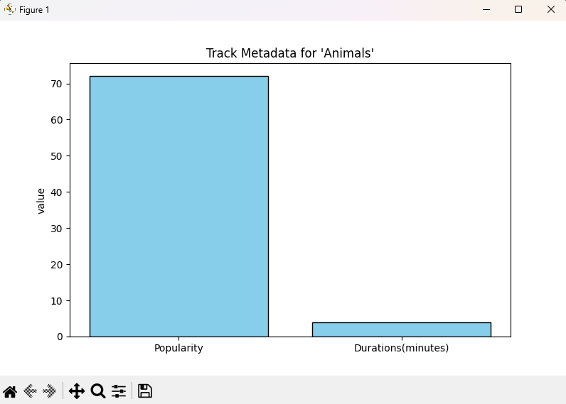

# Spotify Data Analysis

This project uses the [Spotify Web API](https://developer.spotify.com/documentation/web-api/) via the **Spotipy** Python library to fetch track metadata and visualize it using **Pandas** and **Matplotlib**.  

The project demonstrates how to:
- Authenticate with the Spotify API.
- Retrieve track information (name, artist, album, popularity, duration).
- Store track data in a Pandas DataFrame.
- Visualize selected metadata with a bar chart.
- Push the data into a database

---

## 🔧 Tech Stack
- **Python 3.x**
- [Spotipy](https://spotipy.readthedocs.io/) (Spotify API wrapper)
- [Pandas](https://pandas.pydata.org/)
- [Matplotlib](https://matplotlib.org/)

---

## ⚙️ Setup Instructions

### 1. Clone Repository
```bash
git clone https://github.com/muthugokulx/spotify-data-analysis.git
cd spotify-data-analysis
```
---

## Install Dependencies
```bash
pip install spotipy pandas matplotlib requests

```

## 📊 Example Output

Bar chart comparing track popularity and duration in minutes for the given song.



